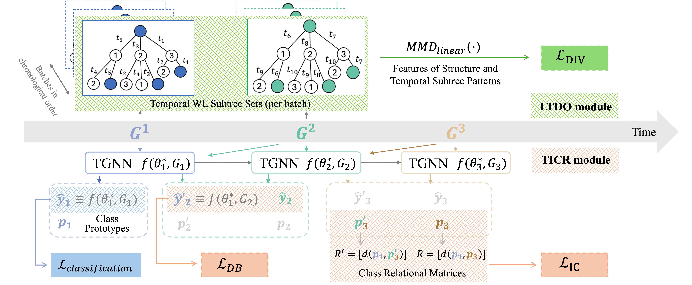

# N-ForGOT: Towards Not-forgetting and Generalization of Open Temporal Graph Learning

Official Implementation of "[**N-ForGOT: Towards Not-forgetting and Generalization of Open Temporal Graph Learning (ICLR 2025)**](https://openreview.net/pdf/65e7cb24ed0f8b294e78217a7ade7b5c240332c0.pdf)."
<div align="center">
  

  N-ForGOT Framework
</div>
 

<div style="text-align:"><strong>TL;DR:</strong> This paper targets balancing knowledge preservation from existing data with swift adaptation to incoming, unseen classes in Open Temporal Graphs. </div>

## **Datasets and Checkpoints**

We offer the processed datasets and the trained model for immediate use, available for download at [link](https://drive.google.com/drive/u/1/folders/1fIabwkdw3D18cX5CP3Mo-xspshL4yRyj).

Please save the dataset files in the ‘data/’ directory and the .pth model files in the ‘log/’ directory.

## **Quick Start**

```
git clone 
conda create --name NForGOT --file requirements.txt
conda activate NForGOT

python run.py
```

## **Acknowledgement**

Thanks to [Hammer](https://github.com/liuhanmo321) for the support with the implementation earlier. I hope to hear good news about his paper soon.

Thanks to the following open-source repositories for their support in building this implementation: [OTGNet](https://github.com/tulerfeng/OTGNet),  [CGLB](https://github.com/QueuQ/CGLB).

## **Citation**

Please kindly cite our paper if you use our model or code. 
```

```
